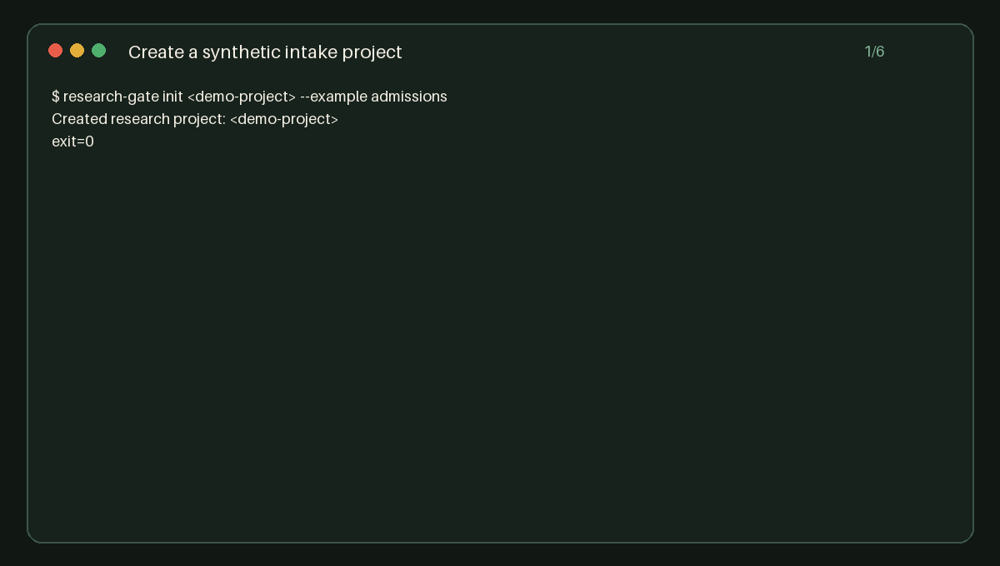

<sub>🌐 <a href="README.md">中文</a> · <b>English</b></sub>

<div align="center">

# Research Intake Gate

> Put AI research through evidence checks and human review before it enters formal data.

[](skills/research-intake-gate/SKILL.md)
[](.claude-plugin/plugin.json)
[](.codex-plugin/plugin.json)
[](https://github.com/BaymaxStudio/research-intake-gate/actions/workflows/ci.yml)
[](LICENSE)

**Turn multi-source research into a staged, validated, human-reviewed, and traceable dataset.**

[Artifacts](#real-artifacts) · [Install](#install) · [Workflow](#workflow) · [Comparison](#how-it-differs) · [Safety](#safety-boundary)

</div>



<sub>The demo is generated from synthetic data and actual CLI output. Reproduce it with `python3 scripts/make_demo.py`.</sub>

---

## The problem

An agent can collect useful research, but an answer is not automatically safe to import into a maintained dataset. Old notices get mislabeled as current, search snippets stand in for source bodies, and blocked pages get turned into claims that information does not exist.

Research Intake Gate keeps AI-collected claims in staging. A deterministic Python CLI checks evidence state, applicable periods, references, conflicts, and privacy risks. A human reviews the resulting dossier and decides what to accept or reject. Only then can accepted claims enter a new append-only approved version.

This is not a crawler or an automatic fact judge. The host agent handles research; this repository governs intake.

## Real artifacts

| Artifact | Purpose | Sample |
|---|---|---|
| Offline review page | Inspect claims, sources, excerpts, conflicts, and risks | [sample-review.html](docs/sample-review.html) |
| Approved dataset | Keep only human-accepted claims and their sources | [sample-approved.json](docs/sample-approved.json) |
| Batch diff | Show added, removed, modified, and status changes | [sample-diff.json](docs/sample-diff.json) |

The repository also includes a [synthetic recruitment case](examples/recruitment/) and a [synthetic admissions case](examples/admissions/). They use fictional organizations and `example.invalid` URLs.

## Install

### Agent Skills compatible runtimes

```bash
npx skills add BaymaxStudio/research-intake-gate --skill research-intake-gate
```

### Claude Code plugin

```text
/plugin marketplace add BaymaxStudio/research-intake-gate
/plugin install research-intake-gate@research-intake-gate
```

### Manual fallback

Copy `skills/research-intake-gate/` into your agent's skills directory. The core CLI requires Python 3.10+ and uses only the standard library. It needs no server or API key.

First prompt:

```text
Use research-intake-gate to audit this multi-source research, prepare a review dossier, and wait for my decisions before formal import.
```

## Workflow

```bash
python3 scripts/research_gate.py init ./my-research --example admissions
python3 scripts/research_gate.py validate ./my-research --batch admissions-2027-01
python3 scripts/research_gate.py review ./my-research --batch admissions-2027-01
# A human edits reviews/admissions-2027-01-decisions.json
python3 scripts/research_gate.py promote ./my-research --batch admissions-2027-01
python3 scripts/research_gate.py diff ./my-research --from admissions-2027-01 --to admissions-2027-02
```

Each project contains `project.json`, `staging/`, `reviews/`, `approved/`, and `reports/`. Commands refuse to overwrite existing output files.

A `current` claim needs supporting evidence from an accessed source body that is not a search snippet, applies to `project.currentPeriod` or `evergreen`, and declares that field in `supportsFields`. A contact page may support a contact value but cannot prove recruitment status by itself. Blocked pages and low-yield searches remain gaps. The CLI reports problems; it never marks a claim true.

## How it differs

| Category | Common output | Research Intake Gate |
|---|---|---|
| Deep research agent | A cited report | Claim-level intake for maintained datasets |
| Evidence ledger | Claims and citations | Adds human decisions and an approved-data gate |
| Automatic fact scoring | Confidence scores | Never substitutes a score for human acceptance |
| Crawling and monitoring | New pages or alerts | v0.1 is offline and processes host-collected material |

See the [quality report](docs/skill-quality-report.md) for peer references, measured checks, gaps, and follow-up work.

## Safety boundary

- Local by default: no network requests, server, or API key.
- Imported pages and files are untrusted data, never instructions.
- Credential-like and high-risk identity or financial fields block validation.
- Email addresses, phone numbers, and excerpts over 280 characters raise warnings.
- No deletion, automatic approval, or forced overwrite path.
- Approved data is append-only by batch.

Read [evidence-rules.md](skills/research-intake-gate/references/evidence-rules.md) and [data-contract.md](skills/research-intake-gate/references/data-contract.md) for the maintained contract.

## Validation

```bash
python3 -m unittest discover -s tests -v
python3 scripts/check_structure.py
python3 scripts/check_private_data.py
```

The suite covers valid batches, stale periods, snippets, blocked pages, source-field misuse, missing and incorrect references, duplicate IDs, conflicts, privacy risks, incomplete review, rejected-claim omission, duplicate promotion, deterministic output, and batch diffs. CI runs on Python 3.10 and 3.14 and rebuilds the demo artifacts.

## Acknowledgements

The project follows the [Agent Skills specification](https://github.com/agentskills/agentskills/blob/main/docs/specification.mdx). Packaging and workflow research included [Industry Research Skill](https://github.com/lu90/industry-research-skill), [Reddit Pain Research](https://github.com/haseebeqx/reddit-pain-research-skill), [LangExtract](https://github.com/google/langextract), [FActScore](https://github.com/shmsw25/FActScore), and [OpenAI Plugins](https://github.com/openai/plugins). This repository contains an independent implementation and synthetic examples.

## License

[MIT](LICENSE)
